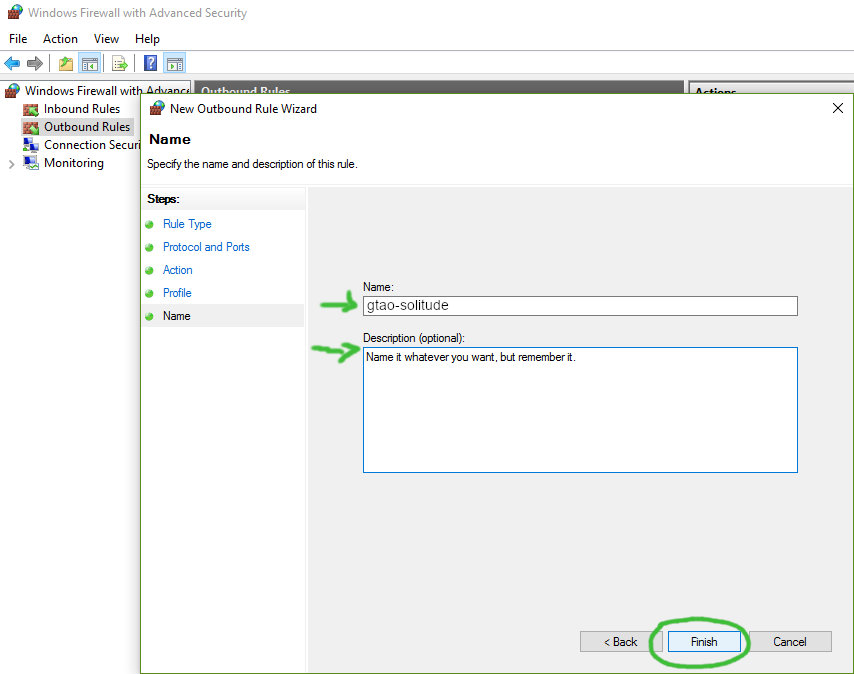

# gtao-solitude

Play in a public GTA Online session with all game activities enabled, but in peace. This approach is sometimes also called an "empty session generator".

---

- [What This Script Does](#what-this-script-does)
- [First Time Configuration](#first-time-configuration)
  - [Firewall Setup](#firewall-setup)
  - [Script Configuration](#script-configuration)
- [Usage](#usage)
- [Known Issues](#known-issues)
- [Related Links](#related-links)
- [License](#license)

---

## What This Script Does

The script runs in a terminal window. It blocks specific internet ports from time to time. This will result in other players "leaving" your session (but in reality you're the one who's getting disconnected). The game doesn't get interrupted while this happens.

No game files are touched during this process. It's neither hacking nor modding.

Find a [demo video on YouTube](https://www.youtube.com/watch?v=a0FeJ0v3LoM).

---

## First Time Configuration

Follow these steps to make the script functional.

### Firewall Setup

For those who have the Windows Firewall disabled by default: You can keep it disabled. The script will only enable it when needed and disable it again afterwards.

1. Open the Windows Firewall.

2. Click **Advanced settings**.

3. Click **Outbound Rules** and then **New Rule...**. This opens a Dialog.

4. Select **Port** as rule type. Click **Next**.

5. Select **UDP** and enter the following ports separated with commas: `6672, 61455, 61457, 61456, 61458`. Click **Next**.

6. Select **Block the connection**. Click **Next**.

7. Select **Domain**, **Private** and **Public**. Click **Next**.

8. Enter a name for this rule. Can be anything you want, just remember it. Click **Finish**.

9. Click **Outbound Rules** and then **Disable Rule** for now. The script will toggle it later on/off and you don't want to have this rule always enabled.

### Script Configuration

Open `gtao-solitude.cmd` in a text editor and adjust the configuration.

`firewallRuleName`: The name of the rule from **step 8** in the **Firewall Setup** section. Default: `gtao-solitude`.

`networkTimeout`: How many seconds the rule should stay enabled. If you don't get the expected result try increasing this value gradually by 1 second. Default: `15`.

`repeatInterval`: After how many seconds the script should repeat itself to keep rejoining players out. Default: `180`.

`startupDelay`: How many seconds to wait until the script should start to work. Set this to a value that's about 1 minute longer than you need to start the game and join a public session. Default: `240`.

---

## Usage

Once you're done with the **First Time Configuration** section, this is all you have to do:

1. Right-click on `gtao-solitude.cmd` and choose **run as Administrator**.
2. Start the game and join a public GTA Online session.
3. Let the script do its thing.
4. Close the script window when you're done playing or just want to let others stay in your session again.

---

## Known Issues

If you close the script window while it's "performing magic", the firewall rule might stay enabled. The script will tell you when it's okay to stop.

---

## Related Links

- GTA Online PC Connection Troubleshooting: <https://support.rockstargames.com/articles/200525767/GTA-Online-PC-Connection-Troubleshooting>
- GTA Online Official Website: <https://www.rockstargames.com/gta-online>
- Rockstar Service Status: <https://support.rockstargames.com/servicestatus>

---

## License

Public Domain Worldwide
